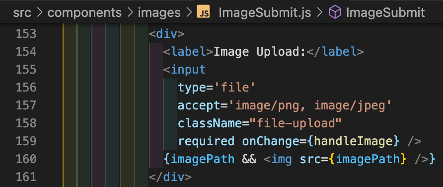

# General Assembly Project 3: PictuREST

## Table of Contents:
1. [Overview](#overview)
1. [Brief](#brief)
1. [Approach](#approach)
1. [Work Split](#work-split)
1. [Wins](#wins)
1. [Challenges](#challenges)
1. [Key Learnings/Takeaways](#key-learningstakeaways)
1. [Future Features](#future-features)
1. [Bugs](#bugs)

## Overview:
My third project in the Software Engineering Immersive Course and my first time coding in a group with [Holly Stratton](https://github.com/hollylouisarose) and [Felix Fenn Evans](https://github.com/Felix-FE). The project was to create a picture uploading website with a mapping element and user accounts and the ability to edit, favorite, and follow.

## Brief:
**Goal:** Create a website for sharing images that included a mapping element.

**Timeframe:** 1 week.

**Groupsize:** 3 people.

**Frontend software used:** JavaScript, React, Sass, Tachyons.

**Backend software used:** Bcrypt, Express, Faker, JSONWebToken, Mongoose.

**Deployed version:** https://sei-kiratarik-project-three.netlify.app

## Approach:
First we discussed what our project should be together, eventually coming up with some wireframes:

## Work Split:
We split off tasks early on in our group; After some basics of components were established I focussed on the Image pages including submitting, editing, and displaying. I would also pitch in on some other parts including the filtering and map pins of the home page and attempting to make the followers section on the user page work. We mostly did our own things, contacting each other when we ran into roadblocks to help each other out. I didn’t do much of the styling although I did code the popups of the home page map. I took no part in coding the backend of this project.

I started off making a lot of component folders for different parts of the frontend we had planned so far. I then created a basic Nav-Route in the App.js folder which was added to over time

Shortly afterwards we split up the tasks with me being responsible for the Images section. I started with ImageSubmit; creating a lot of the basics I would reuse in other Image sections:

I started with the form with things being added over time as we figured out how we wanted the data entered. The name and description were basic text inputs.

The file upload was relatively simple, but it took a while, and a lot of googling, to get the preview image to work before the uploading occured:

The type tags and custom tags came later using a react software that allows for multiple inputs from multiple choices and even custom choices.

The location inputs allowed the user to type in longitude and latitude if they knew them, updating the pin on the map. Conversely, moving the pin on the map updated the values on the longitude and latitude inputs. A large portion of the functions was ensuring that an invalid number or string wasn’t accepted and ensuring a wrap-around effect if the pin was moved too far east or west:

The map was quite simple with a movable pin, the ability to move, zoom, and so on. The pin was an emoji symbol offset so that the point on the bottom center was exactly over the location. Sadly I later learned that this pin doesn’t work for all browsers:

The regions section uses a public API that returns information about an area based on latitude and longitude submitted to it. I use it to create location based tags:

The madeBy shows the username of the user submitting the image while the submit button is relatively simple except for the imageUploading section where the image file is uploaded and a url is returned. I also added a loading text for this section:

I then largely copied the code over to the ImageEdit component with the main difference being a getImage on load: 

I then changed tracks to code the filters on the Home page. I used the react select system again, each with its own onChange function. I made it so that on changing the option selected it would filter the images and also change the country options you can select based on what continent was already selected:

I also added map markers that get filtered alongside the images and made it so that clicking on them made an image preview popup that had the name on top of the image with white-bordered black text so that the words are always visible:

I then went to the ImageShow section, copying large portions from the other Image sections and added a favorite/unfavorite button. It only showed up if you were logged in and worked by adding/removing the image id from an array of favorited images. I then went into the user section and coded the displaying of image cards of favorited images:

I then fixed an issue with the navbar where it wouldn’t update when changing urls. I used the useLocation function from react router dom to ensure it updated on url change:

I then coded a linked list of users being followed by the logged-in user in Myfollows. After this I went around making minor fixes in the code and polishing it to look nicer.

Finally the Myfollows section underwent many changes late in the coding due to not always displaying all of the followed usernames especially when there were a lot of them. This was eventually discovered to be due to issues of running async functions inside a map function which caused several simultaneous reading and overwriting of the same variable. Even with extensive searching, coding, and getting help from teachers, I was unable to fix the problem entirely. I eventually managed to make it work by essentially checking if the resulted list was of the correct length and redoing the process if it wasn’t. This worked except for occasionally getting stuck in a loading screen instead of outputting the result. I ran out of time in the project before I could finish my fix attempt.

## Wins:
A win was coding the latitude and longitude to account for values beyond the normal [-180,180], [-90, 90] such that it looped to the correct values.

Another win was displaying previews of the image you wanted to upload.

## Challenges:
A challenge was getting all the search-bars in the main screen to work together, including not giving location options that were impossible.

## Key Learnings/Takeaways:
A key learning was that while splitting the work up such that everyone is working in different components makes it easy to stay out of each other's way; it makes it harder to understand what the others are doing and required we have daily meetings discussing what we were doing and even then I didn’t know most of what was done in the backend.

## Future Features:
A future feature would be the map on the home page showing only a certain number of pins at a time and cycling through all of the pins.

## Bugs:
An enduring Bug is when trying to get a list of followed people, the code to find and display the usernames ends up being a loop that causes async functions which end up interfering with each other when trying to store the information in an array. The best I was able to get was to code it such that it either displays all the followed people's names or is stuck in an infinite loading.

Some more bugs were the images and mapbox not displaying after deployment. The maps were fixed by using my own mapbox access token and setting the mapstyle to a default one. The images were fixed by changing a section in the urls from “&auto=format” to “&format=auto”:

